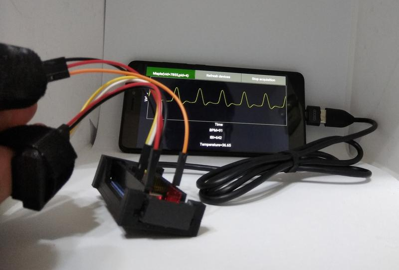

# Kivy Pulse Sensor Viewer Demo
This example uses a Kivy Garden Graph package to draw Arduino pulse sensor data on a PC/phone screen. We have tested this example on Ubuntu and Android systems and got acceptable results even on middle-end Android phones. To use this example, you will need an Arduino board with a pulse sensor and a USB cable for connecting between the PC/phone and the Arduino board. USB serial interface is used to deliver sensor data. In addition to the pulse sensoro, we follow the transmission format of the pulse sensor library to add a label widget for displaying temperature sensor value. The transmission format is quite simple. You can also try to add other sensors and show received values at will.
## Software prerequisites
- **kivy.garden.graph**
We use Kivy Garden(visit: http://kivy-garden.github.io/ for more information) Graph to draw the waveform of pulse sensor data.
You can install it with pip, and then install a garden package:
```
pip3 install kivy-garden
garden install graph
```
- **usbserial4a**
We use usbserial4a(visit: https://github.com/jacklinquan/usbserial4a/ for more information) on Android platform. You can install it with pip:
```
pip3 install usbserial4a
```
## Running demo
- **Android**
You can use Pydroid App to open kivy_pulsesensor_viewer_demo.py and run it. Since this demo relies on garden packages, you can add --app to the garden install command and then garden packages will be included in a libs/garden directory under your current directory. For example:
```
cd myapp
garden install --app graph
```
- **Ubuntu**
```
sudo python3 kivy_pulsesensor_viewer_demo.py
```

